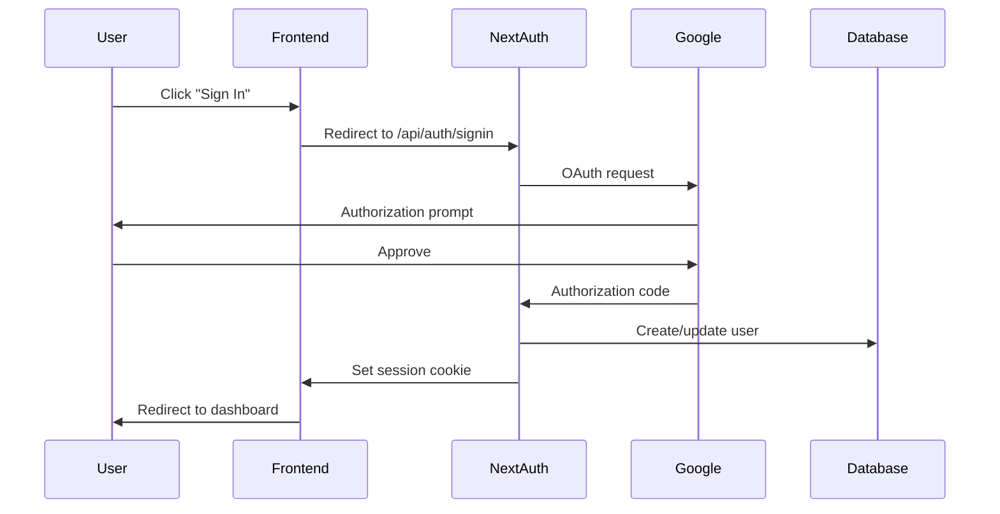

# Authentication API

> **Audience**: Developers
> **Last Updated**: February 8, 2026

## Overview

Money Tracker uses NextAuth.js with Google OAuth 2.0 for authentication. All API routes (except `/api/auth/*`) require an authenticated session.

## Authentication Flow



## Endpoints

### Sign In

```http
GET /api/auth/signin
POST /api/auth/signin
```

Redirects to Google OAuth consent screen. After successful authentication, creates a session and redirects to the callback URL.

**Parameters**: None (handled by NextAuth)

**Response**: Redirect to application

### Sign Out

```http
GET /api/auth/signout
POST /api/auth/signout
```

Terminates the current session and clears the session cookie.

**Response**: Redirect to sign-in page

### Get Session

```http
GET /api/auth/session
```

Returns the current user's session information.

**Response**:
```json
{
  "user": {
    "id": "cuid123",
    "name": "John Doe",
    "email": "john@example.com",
    "image": "https://..."
  },
  "expires": "2026-03-08T00:00:00.000Z"
}
```

If not authenticated:
```json
null
```

### Callback

```http
GET /api/auth/callback/google
```

OAuth callback endpoint. Automatically handled by NextAuth. Do not call directly.

## Protected Routes

All `/api/*` routes (except `/api/auth/*`) require authentication. Unauthorized requests receive a 401 response.

### Server-Side Protection

API routes use the `requireAuth()` helper:

```typescript
import { requireAuth } from '@/lib/session';

export async function GET(request: Request) {
  const user = await requireAuth();
  // user is guaranteed to exist

  // Your API logic here
}
```

### Client-Side Protection

Frontend components use NextAuth's `useSession()` hook:

```typescript
import { useSession } from 'next-auth/react';

function Component() {
  const { data: session, status } = useSession();

  if (status === 'loading') return <div>Loading...</div>;
  if (status === 'unauthenticated') return <div>Access Denied</div>;

  // Authenticated user
  return <div>Welcome {session.user.name}</div>;
}
```

## Session Management

### Session Duration

Sessions last **30 days** by default. The session is automatically refreshed on each request.

### Session Storage

Sessions are stored in the PostgreSQL database using Prisma adapter. Session tokens are stored as HTTP-only cookies for security.

### Multiple Devices

Users can be signed in on multiple devices simultaneously. Each device maintains its own session.

## Configuration

Authentication is configured in `lib/auth.ts`:

```typescript
export const authOptions = {
  adapter: PrismaAdapter(prisma),
  providers: [
    GoogleProvider({
      clientId: process.env.GOOGLE_CLIENT_ID!,
      clientSecret: process.env.GOOGLE_CLIENT_SECRET!,
    }),
  ],
  session: {
    strategy: 'jwt',
    maxAge: 30 * 24 * 60 * 60, // 30 days
  },
  // ...
};
```

## Environment Variables

Required environment variables for authentication:

```env
NEXTAUTH_SECRET=your-secret-key-here
NEXTAUTH_URL=http://localhost:3000
GOOGLE_CLIENT_ID=your-google-client-id
GOOGLE_CLIENT_SECRET=your-google-client-secret
```

See [Configuration Guide](../getting-started/configuration.md) for setup instructions.

## Security Features

- ✅ HTTP-only session cookies (prevents XSS)
- ✅ Secure cookies in production (HTTPS only)
- ✅ CSRF protection built-in
- ✅ Session tokens rotated on sign-in
- ✅ Database-backed sessions
- ✅ Automatic session expiration

## Troubleshooting

### "Unauthorized" errors

- Ensure you're signed in through the frontend
- Check that session cookie is present
- Verify NEXTAUTH_URL matches your domain

### OAuth redirect errors

- Verify authorized redirect URIs in Google Console
- Check NEXTAUTH_URL is correct
- Ensure Google OAuth credentials are valid

See [Authentication Troubleshooting](../troubleshooting/authentication-issues.md) for more details.

## Related Documentation

- [Configuration Guide](../getting-started/configuration.md)
- [Architecture: Authentication](../architecture/authentication.md)
- [Troubleshooting: Authentication](../troubleshooting/authentication-issues.md)

---

*Next: [Accounts API](./accounts.md)*
