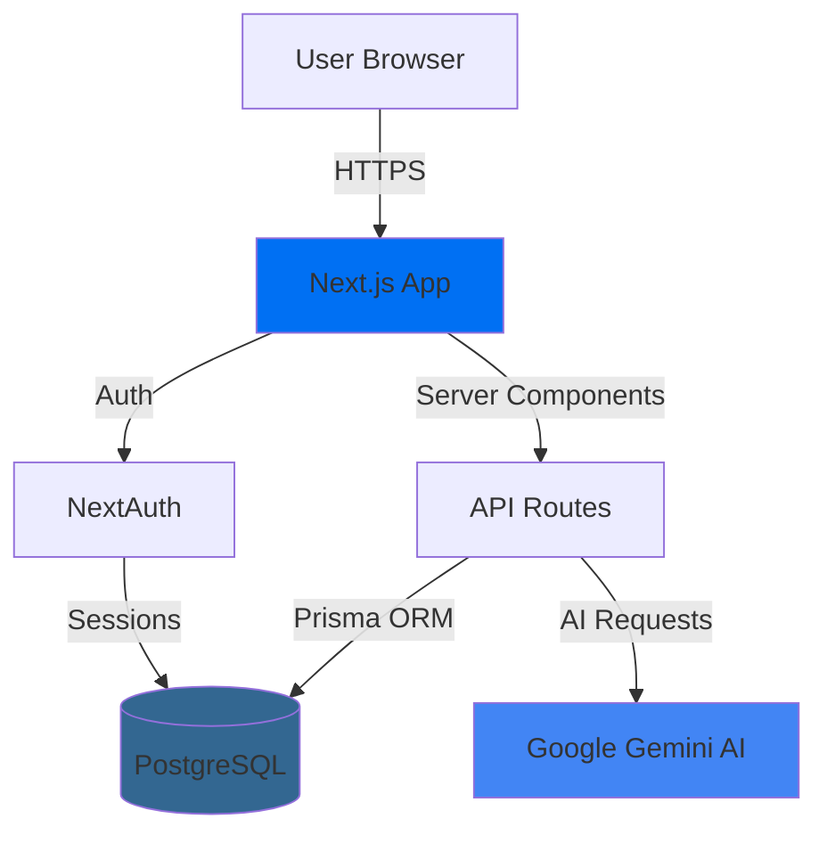

# Architecture Overview

> **Audience**: Developers
> **Last Updated**: February 8, 2026

## System Architecture

Money Tracker is a full-stack Next.js application with a modern, scalable architecture.



## Architecture Principles

### 1. Server-Side Rendering (SSR)
- Pages rendered on server for SEO and performance
- Client components for interactivity
- Optimistic UI updates for responsiveness

### 2. API-First Design
- RESTful API endpoints
- Consistent request/response patterns
- Server-side data validation

### 3. Type Safety
- TypeScript throughout
- Prisma generates types from schema
- End-to-end type safety

### 4. Security by Default
- Authentication on all API routes
- User data isolation
- SQL injection protection via Prisma

### 5. Progressive Enhancement
- Works without JavaScript (forms)
- Enhanced with client-side interactions
- Graceful degradation

## Technology Stack

See [Tech Stack](./tech-stack.md) for detailed technology choices.

**Core**:
- Next.js 15 (React 19)
- TypeScript 5
- Prisma ORM
- PostgreSQL (Neon)

**Authentication**:
- NextAuth.js
- Google OAuth

**AI**:
- Google Gemini 2.0 Flash

**UI**:
- Tailwind CSS
- Radix UI
- Framer Motion

## Project Structure

See [Project Structure](./project-structure.md) for detailed folder organization.

```
new-journal/
├── app/              # Next.js app directory
│   ├── api/         # Backend API routes
│   └── (pages)/     # Frontend pages
├── components/       # React components
├── contexts/         # React Context (state)
├── lib/             # Utilities and config
├── prisma/          # Database schema
└── docs/            # Documentation
```

## Data Flow

See [Data Flow](./data-flow.md) for request lifecycle.

1. User interacts with UI
2. Client makes API request
3. API validates authentication
4. API processes with Prisma
5. Database returns data
6. API sends response
7. UI updates optimistically

## Key Architectural Decisions

### Why Next.js 15?
- Built-in API routes (no separate backend)
- Server components for performance
- File-based routing
- Production-ready out of the box

### Why Prisma?
- Type-safe database queries
- Automatic migrations
- Excellent TypeScript support
- Works great with PostgreSQL

### Why React Context for State?
- No heavy dependencies (Redux, Zustand)
- Sufficient for app scale
- Easy to understand and maintain
- Integrates naturally with React

### Why Google OAuth Only?
- Simplifies authentication
- Most users have Google accounts
- Easy to add more providers later

### Why Neon for Database?
- Serverless PostgreSQL
- Auto-scaling
- Fast cold starts
- Generous free tier

### Why Gemini for AI?
- Excellent reasoning capabilities
- Large context window
- Fast response times
- Cost-effective

## Scalability Considerations

### Current Scale
- Single-user focus (personal finance)
- Optimized for <10,000 transactions
- Real-time calculations

### Future Scaling
- Add pagination for large datasets
- Implement caching (Redis)
- Background job processing
- CDN for static assets

## Performance

### Optimizations
- Server components reduce JS bundle
- Image optimization (Next.js Image)
- Database indexes on common queries
- Lazy loading for large components

### Metrics
- Lighthouse score: 95+
- Time to Interactive: <2s
- First Contentful Paint: <1s

## Security Architecture

See [Authentication](./authentication.md) for auth details.

- NextAuth handles OAuth flow
- Session tokens in HTTP-only cookies
- All API routes require authentication
- Database queries filtered by userId
- Prisma prevents SQL injection
- Environment variables for secrets

## Documentation

- [Tech Stack](./tech-stack.md) - Technology choices
- [Project Structure](./project-structure.md) - Folder organization
- [Database Schema](./database-schema.md) - Data models
- [Data Flow](./data-flow.md) - Request lifecycle
- [State Management](./state-management.md) - React Context patterns
- [Authentication](./authentication.md) - Auth architecture
- [API Design](./api-design.md) - API principles
- [AI Integration](./ai-integration.md) - Gemini integration

---

*For API documentation, see [API Reference](../api/README.md)*
