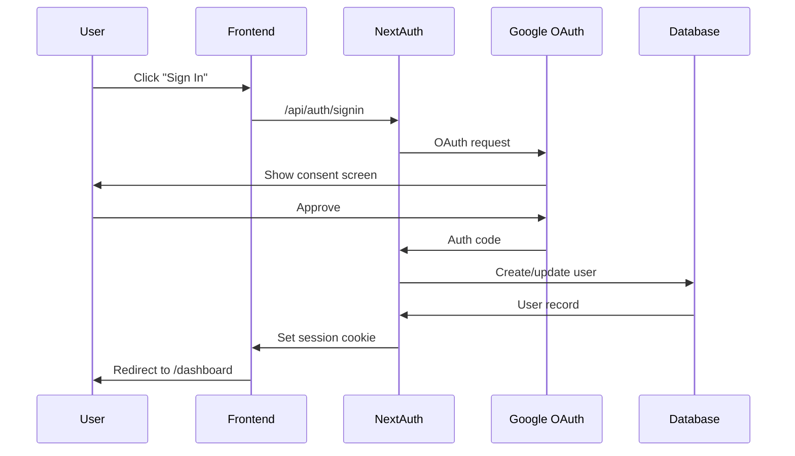

# Authentication Architecture

> **Audience**: Developers
> **Last Updated**: February 8, 2026

## Overview

Money Tracker uses NextAuth.js with Google OAuth for secure, passwordless authentication.

## Authentication Flow



## NextAuth Configuration

Located in `lib/auth.ts`:

```typescript
import { PrismaAdapter } from '@auth/prisma-adapter';
import GoogleProvider from 'next-auth/providers/google';
import { prisma } from './prisma';

export const authOptions = {
  adapter: PrismaAdapter(prisma),
  providers: [
    GoogleProvider({
      clientId: process.env.GOOGLE_CLIENT_ID!,
      clientSecret: process.env.GOOGLE_CLIENT_SECRET!,
    }),
  ],
  session: {
    strategy: 'jwt',
    maxAge: 30 * 24 * 60 * 60, // 30 days
  },
  callbacks: {
    async jwt({ token, user }) {
      if (user) {
        token.id = user.id;
      }
      return token;
    },
    async session({ session, token }) {
      if (session.user) {
        session.user.id = token.id as string;
      }
      return session;
    },
  },
  pages: {
    signIn: '/auth/signin',
    error: '/auth/error',
  },
};
```

## Session Management

### Strategy: JWT
- Tokens stored in HTTP-only cookies
- No database lookup on each request (fast)
- 30-day expiration
- Automatic refresh

### Session Storage
User sessions stored in database via Prisma adapter for:
- Multi-device tracking
- Session revocation
- Security auditing

## Protected Routes

### API Routes

All `/api/*` routes (except `/api/auth/*`) require authentication.

**Implementation** (`lib/session.ts`):
```typescript
import { getServerSession } from 'next-auth';
import { authOptions } from './auth';

export async function requireAuth() {
  const session = await getServerSession(authOptions);
  
  if (!session?.user) {
    throw new Error('Unauthorized');
  }
  
  return session.user;
}
```

**Usage in API routes**:
```typescript
import { requireAuth } from '@/lib/session';

export async function GET(request: Request) {
  const user = await requireAuth();
  
  // User is guaranteed to be authenticated
  const accounts = await prisma.financialAccount.findMany({
    where: { userId: user.id }
  });
  
  return Response.json(accounts);
}
```

### Frontend Pages

Pages use NextAuth's `useSession` hook:

```typescript
import { useSession } from 'next-auth/react';

export default function DashboardPage() {
  const { data: session, status } = useSession();
  
  if (status === 'loading') return <Loading />;
  if (status === 'unauthenticated') return <SignIn />;
  
  // Authenticated
  return <Dashboard user={session.user} />;
}
```

## Google OAuth Setup

### 1. Create OAuth Credentials

1. Go to [Google Cloud Console](https://console.cloud.google.com/)
2. Create project
3. Enable Google+ API
4. Create OAuth 2.0 credentials
5. Add authorized redirect URIs:
   - `http://localhost:3000/api/auth/callback/google` (development)
   - `https://your-domain.com/api/auth/callback/google` (production)

### 2. Configure Environment Variables

```env
GOOGLE_CLIENT_ID=your-client-id.apps.googleusercontent.com
GOOGLE_CLIENT_SECRET=your-client-secret
```

## Security Features

### HTTP-Only Cookies
Session tokens stored in HTTP-only cookies prevent XSS attacks.

### Secure Cookies (Production)
In production (HTTPS), cookies use `Secure` flag.

### CSRF Protection
NextAuth includes built-in CSRF token verification.

### Session Rotation
Session tokens rotated on sign-in for security.

### Database-Backed Sessions
Sessions stored in database for revocation capability.

## User Data Isolation

All database queries filtered by `userId`:

```typescript
// ✅ Correct - user can only see their data
const transactions = await prisma.transaction.findMany({
  where: { userId: user.id }
});

// ❌ Wrong - exposes all users' data
const transactions = await prisma.transaction.findMany();
```

## Error Handling

### Unauthorized (401)
Returned when no session exists or session expired.

**Response**:
```json
{
  "error": "Unauthorized"
}
```

### Forbidden (403)
Returned when attempting to access another user's resource.

**Response**:
```json
{
  "error": "Access denied"
}
```

## Multi-Device Support

Users can be signed in on multiple devices simultaneously. Each device has its own session.

## Sign Out

Sign out clears session cookie and removes database session:

```typescript
import { signOut } from 'next-auth/react';

function SignOutButton() {
  return (
    <button onClick={() => signOut()}>
      Sign Out
    </button>
  );
}
```

## Related Documentation

- [Authentication API](../api/authentication.md)
- [Configuration Guide](../getting-started/configuration.md)
- [Troubleshooting Auth](../troubleshooting/authentication-issues.md)

---
