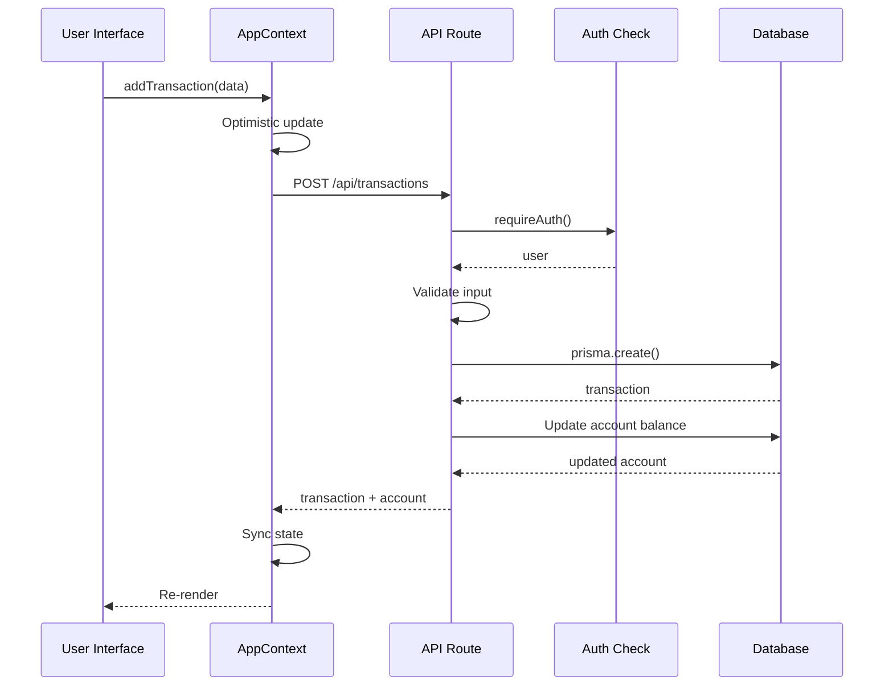
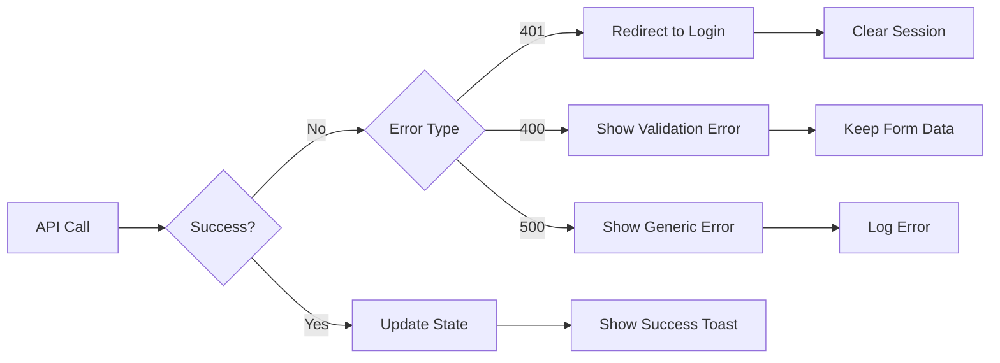

# Data Flow

> **Audience**: Developers
> **Last Updated**: February 8, 2026

## Request Lifecycle

### 1. User Action
User clicks button or submits form in the frontend.

### 2. API Request
Frontend makes HTTP request to API endpoint.

```typescript
const response = await fetch('/api/transactions', {
  method: 'POST',
  headers: { 'Content-Type': 'application/json' },
  body: JSON.stringify(transactionData)
});
```

### 3. Authentication Check
API route validates session.

```typescript
const user = await requireAuth();
// Throws error if not authenticated
```

### 4. Input Validation
Request data validated.

```typescript
if (!body.amount || body.amount <= 0) {
  return Response.json({ error: 'Invalid amount' }, { status: 400 });
}
```

### 5. Database Operation
Prisma executes query.

```typescript
const transaction = await prisma.transaction.create({
  data: {
    ...body,
    userId: user.id
  }
});
```

### 6. Side Effects
Related data updated (balances, budgets, etc.).

### 7. Response
API returns result.

```typescript
return Response.json(transaction, { status: 201 });
```

### 8. UI Update
Frontend updates state optimistically or with response data.

```typescript
setTransactions([...transactions, newTransaction]);
toast.success('Transaction created!');
```

## Complete Flow Diagram



## State Management Flow

See [State Management](./state-management.md) for details on AppContext.

### 1. Initial Load
```
App Start → Load Session → Sync Data from API → Populate Context
```

### 2. Create Operation
```
User Action → Optimistic Update → API Call → Sync State → UI Update
```

### 3. Update Operation
```
User Edit → Show Original → API Call → Update State → UI Refresh
```

### 4. Delete Operation
```
User Delete → Confirm → Optimistic Remove → API Call → Sync State
```

## Transaction Creation Flow

Detailed flow for creating a transaction:

```
1. User fills form
2. Click "Create Transaction"
3. Frontend validates input
4. AppContext.addTransaction() called
5. Optimistic update (add to local state)
6. POST /api/transactions
7. API validates session
8. API validates data
9. Prisma creates transaction
10. Account balance updated
11. Budget spending updated
12. Watchlist alerts checked
13. Response returned
14. AppContext syncs state
15. Toast notification shown
16. UI re-renders with new data
```

## Error Handling Flow



## Data Synchronization

### Initial Sync
On app load, two-phase sync:

**Phase 1 - Core Data**:
- Accounts
- Recent transactions (last 300)
- Budgets
- Categories
- Notifications
- Settings

**Phase 2 - Advanced Data**:
- Parties
- Goals
- Watchlists
- Recurring transactions
- Templates
- Settlements
- Receipts

### Real-Time Updates
No WebSockets currently. Updates happen:
- On user action (optimistic)
- After API response
- On page navigation

## Cache Strategy

### Frontend
- AppContext holds all data in memory
- No persistent cache (localStorage could be added)
- Refresh on page load

### Backend
- No caching layer currently
- Database queries on each request
- Future: Redis for frequently accessed data

## Performance Optimizations

### 1. Optimistic Updates
UI updates immediately, then syncs with API.

### 2. Debouncing
Search and filter inputs debounced to reduce API calls.

### 3. Pagination (Future)
Large datasets will be paginated.

### 4. Lazy Loading
Heavy components loaded on-demand.

## Related Documentation

- [State Management](./state-management.md)
- [API Design](./api-design.md)
- [Architecture Overview](./README.md)

---
