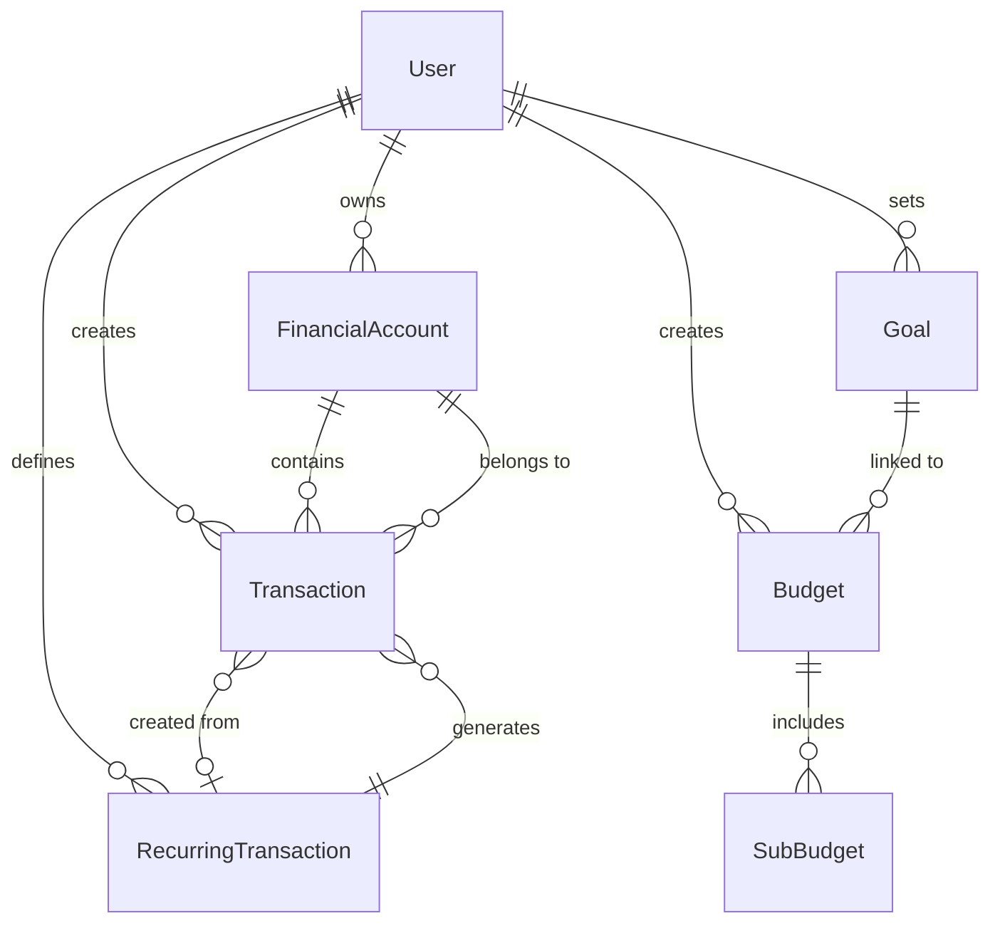

# Database Schema

> **Audience**: Developers
> **Last Updated**: February 8, 2026

## Overview

Money Tracker uses PostgreSQL with Prisma ORM. The schema is defined in `prisma/schema.prisma`.

## Entity Relationship Diagram



## Core Models

### User
Authentication and user profile.

**Fields**:
- `id`: Unique identifier
- `email`: User email (from OAuth)
- `name`: Display name
- `image`: Profile picture URL

**Relations**:
- Has many: accounts, transactions, budgets, goals, etc.

### FinancialAccount
Bank accounts, credit cards, savings.

**Fields**:
- `name`: Account name
- `balance`: Current balance (auto-updated)
- `type`: "checking" | "savings" | "credit"
- `color`, `icon`: UI customization

### Transaction
Income and expense records.

**Fields**:
- `description`: What the transaction is for
- `amount`: Transaction amount (always positive)
- `date`: When it occurred
- `category`: Category name
- `type`: "income" | "expense"
- `party`: Payee/payer name
- `notes`: Additional details
- `tags`: Array of tag strings

**Relations**:
- Belongs to: FinancialAccount
- Optional: RecurringTransaction (if auto-created)

### Category
Transaction categorization.

**Fields**:
- `name`: Category name
- `type`: "income" | "expense" | "both"
- `color`, `icon`: UI customization

### Budget & SubBudget
Budget planning with category allocations.

**Budget Fields**:
- `name`: Budget name
- `type`: "monthly" | "event" | "trip"
- `totalAllocated`: Total budget amount
- `startDate`, `endDate`: Budget period

**SubBudget Fields**:
- `category`: Category name
- `allocated`: Amount allocated
- `spent`: Amount spent (calculated)
- `alertThreshold`: Warning percentage

### Goal
Savings goals tracking.

**Fields**:
- `name`: Goal name
- `targetAmount`: Target amount
- `currentAmount`: Progress so far
- `targetDate`: Deadline
- `monthlyContribution`: Suggested monthly savings

### RecurringTransaction
Recurring bills and income.

**Fields**:
- `description`, `amount`, `category`, `type`: Transaction details
- `frequency`: "daily" | "weekly" | "biweekly" | "monthly" | "quarterly" | "yearly"
- `nextDueDate`: When next occurrence is due
- `autoCreate`: Whether to auto-create transactions
- `reminderDays`: Days before to send reminder

### Watchlist
Custom spending alerts.

**Fields**:
- `name`: Watchlist name
- `type`: "category" | "tag" | "payee"
- `value`: What to watch (category name, tag, payee)
- `budgetLimit`: Spending limit
- `alertThreshold`: Warning percentage

## AI & Features Models

### ChatMessage
AI assistant conversation history.

**Fields**:
- `role`: "user" | "assistant"
- `content`: Message text
- `metadata`: Additional context (JSON)

### Insight
AI-generated financial insights.

**Fields**:
- `type`: "spending_pattern" | "budget_alert" | "goal_progress" | "recommendation" | "anomaly"
- `title`: Insight title
- `description`: Detailed description
- `severity`: "info" | "warning" | "critical" | "success"
- `data`: Supporting data (JSON)

### Notification
User notifications.

**Fields**:
- `type`: "budget" | "bill" | "goal" | "recurring" | "info" | "warning"
- `title`: Notification title
- `message`: Notification text
- `isRead`: Read status

### TransactionTemplate
Saved transaction patterns.

**Fields**:
- `name`: Template name
- `description`, `amount`, `category`, etc.: Transaction defaults

### Settlement
Split expense tracking.

**Fields**:
- `party`: Who owes/is owed
- `amount`: Amount
- `type`: "owed_to_me" | "i_owe"
- `isSettled`: Settlement status

### Receipt
Transaction attachments.

**Fields**:
- `transactionId`: Linked transaction
- `fileName`, `fileUrl`, `fileType`, `fileSize`: File details

## Indexes

Key indexes for performance:

```prisma
@@index([userId])                # User data isolation
@@index([date])                  # Transaction date queries
@@index([category])              # Category filtering
@@index([nextDueDate])           # Recurring processing
@@index([isRead])                # Unread notifications
```

## Relationships

### One-to-Many
- User → FinancialAccounts
- User → Transactions
- FinancialAccount → Transactions
- Budget → SubBudgets

### Many-to-One
- Transaction → FinancialAccount
- Transaction → RecurringTransaction (optional)
- SubBudget → Category (optional)

### One-to-One
- User → UserSettings

## Data Integrity

### Cascade Deletes
- Delete User → Deletes all user data
- Delete FinancialAccount → Deletes transactions
- Delete Budget → Deletes sub-budgets

### Null on Delete
- Delete RecurringTransaction → Keeps generated transactions (sets recurringId to null)
- Delete Category → Keeps transactions (category stored as string)

## Complete Schema

See `prisma/schema.prisma` for the complete schema definition.

## Related Documentation

- [API Reference](../api/README.md)
- [Prisma Docs](https://www.prisma.io/docs)

---
