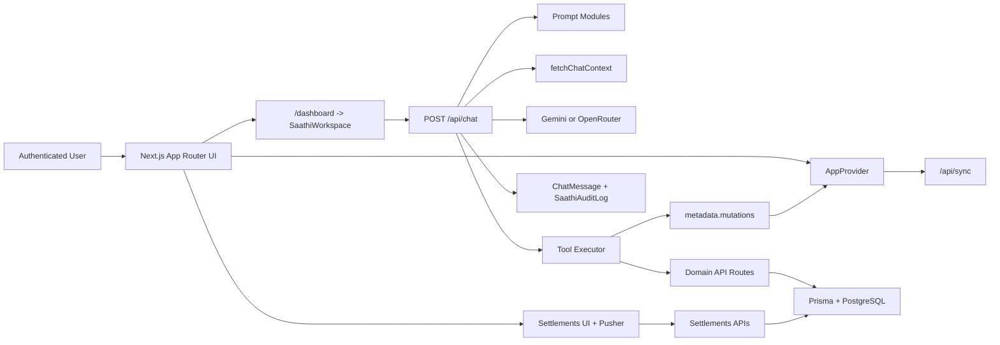

# Current System Documentation

> Audience: engineers onboarding to the current CORE system
> Last Updated: March 6, 2026

## Why This Set Exists

CORE has already moved away from WhatsApp-first usage into the in-product application experience in this repository. The practical entry point for the current system is the authenticated dashboard at `/dashboard`, where Saathi runs as the main workspace.

WhatsApp and Telegram are not part of the active runtime architecture in this codebase today. Mention them only as legacy channels from the transition period. They should be treated as deprecated soon, not as current integration targets.

These documents describe what is actually wired in the repository right now.

## Channel Status

- Native authenticated app:
  - active
  - the real entry point is `/dashboard` -> `SaathiWorkspace` -> `POST /api/chat`
- WhatsApp:
  - legacy transition channel
  - not part of the active runtime in this repository
  - should be treated as deprecated soon
- Telegram:
  - legacy or planned-only mention
  - not part of the active runtime in this repository
  - should be treated as deprecated soon

## Current Product Surface

### Active, mounted routes

- `/`:
  - Public landing page plus Google sign-in entry.
  - Redirects authenticated users to `/dashboard`.
- `/dashboard`:
  - Full-screen `SaathiWorkspace`.
  - This is the main conversational entry point.
- `/transactions` and `/transactions/*`:
  - Overview dashboard, transaction history, budgets, recurring transactions, templates, and legacy settlements screen.
- `/settlements`:
  - Group-chat oriented settlements experience.
- `/analytics`:
  - Charts plus client-side heuristic insight cards.
- `/settings`:
  - Accounts, categories, parties, preferences, advanced tools, Saathi log, and profile.

### Implemented in code but not currently mounted in the main app shell

- `components/chat/SaathiChat.tsx`:
  - Floating chat widget implementation.
- `components/LazySaathiChat.tsx`:
  - Lazy loader for the floating widget.
- `components/chat/SaathiCardDock.tsx`:
  - Searchable shared-card side dock.
- `components/insights/InsightsPanel.tsx`:
  - API-backed insight panel for `/api/insights`.

### Important current-state note

The mounted analytics page uses `components/analytics/InsightCards.tsx`, which computes lightweight insight cards from in-memory transaction data. The separate persisted insight API and `InsightsPanel` exist, but that path is not currently mounted in the app.

## Feature Inventory

### Active and mounted

- Saathi conversational workspace on `/dashboard`
- accounts, categories, and parties management in settings
- transaction dashboard and history
- budgets and budget summaries
- recurring rule management
- transaction templates
- goals and watchlists through settings advanced tools
- personal settlements
- settlement groups with realtime chat, split expenses, reminders, and bill analysis
- receipt storage flows
- analytics charts and heuristic insight cards
- Saathi audit log in settings

### Implemented but not part of the main mounted path

- floating Saathi widget via `components/chat/SaathiChat.tsx`
- lazy wrapper for the floating widget
- Saathi card dock
- API-backed persisted insights panel

### Available to Saathi as prompt context, but not chat-tool mutable

- goals
- watchlists
- recurring rules
- notifications
- receipts
- personal settlements
- settlement groups
- persisted insights

## System In One View

## External Services In Use

- Google OAuth via NextAuth
- PostgreSQL via Prisma
- Google Gemini via `@google/generative-ai`
- OpenRouter via the `openai` client pointed at the OpenRouter base URL
- Pusher Channels for settlement group realtime events

## Current Architecture Summary

- The app shell is `app/layout.tsx`, which mounts `SessionProvider`, `ThemeProvider`, `AppProvider`, `CommandPalette`, and the toaster.
- `AppProvider` is the main client-side data hub. It bootstraps the workspace with a two-phase sync and owns most CRUD-facing state.
- Saathi is not a separate service. The orchestration happens inside `app/api/chat/route.ts`.
- Saathi uses a single structured-response pipeline, not a multi-agent swarm.
- Saathi can read broad financial context, but it can only mutate a subset of domains through tools today:
  - accounts
  - categories
  - parties
  - templates
  - transactions
  - budgets
  - workspace cleanup through `clear_core_data`
- Goals and recent insights are included in prompt context for analysis, but they are not tool-mutable from chat today.
- Recurring processing is client-triggered in `AppProvider`; there is no background scheduler in this repository.

## Read In This Order

1. [Component Map](./component-map.md)
2. [Chat Router](./chat-router.md)
3. [Pipelines](./pipelines.md)
4. [API Surface](./api-surface.md)
5. [Memory And State](./memory-and-state.md)

## Related Existing Docs

- [Architecture Overview](../architecture/README.md)
- [Chat API Reference](../api/chat.md)
- [Saathi Core Knowledge Source](../saathi/CORE_KNOWLEDGE.md)
